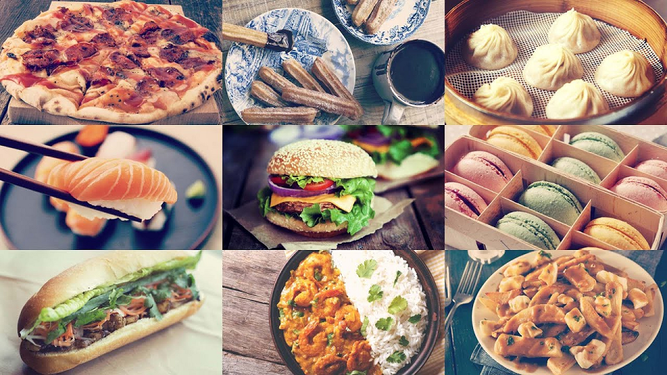

## Project proposal
### Group members: 
Jinhyeun Kim, Youngjo Kim*, and Jianyuan Zhai (* Team leader)

### Introduction
As a part of cultural globalization, we are exposed to various types of cuisines every day. Cuisines are different across different countries and are primarily affected by geographic conditions, such as local climate, religion, and trade. Therefore, classifying the cuisines can be used to improve our understanding of each culture and lifestyle. Ingredients and food preparation methods are the key factors distinguishes one cuisine from others; however, learning thousands of recipes around the world could be an arduous task for the human brain and is superficially understood unless systematic framework exists. At the same time, we noticed that there is already a rich source of food data we can get. Therefore, in this project, we want to build a machine learning classifier that reads a recipe and classifies the origin of the recipe.

### Methods
The project will consist of two parts: 
1. Data acquisition and preprocessing
2. modeling

In the first part, we will need collect a large amount of recipes from recipe websites, such as <a href="https://www.allrecipes.com/" target="_blank">allrecipes.com</a> and <a href="https://www.allrecipes.com/" target="_blank">chowhound.com</a>, and preprocess these recipes into a concise data set. These recipe data will be labeled by their origins. We propose to use supervised learning methods [1], such as Support Vector Machine [2], Logistic Regression and Artificial Neural Networks [3], to build the recipe classifier. We will use a k-fold cross-validation process to find the best parameters of these model. All different types of classifiers will be tested on the same validating set. 

### Expected results
We hope to build a classifier that can accurately find the origin of the recipe. We will compare different supervised learning methods on the precision and accuracy of the classification. We will also identify the most common ingredients and preparation methods shared among the recipes from the same region by incorporating the ratio of the ingredients of the food and do the high dimensional data reduction analysis (e.g., Principal Component Analysis (PCA) [4]).

### Discussion
We believe this is a project that can benefit people who love food and are willing to learn about the culture behind different recipes. Our model can be used in the future as a useful source for the researchers who are interested in discovering the relationship between the cuisines and the lifestyle of the people according to different region and culture. 

### Reference
1. Kotsiantis SB. Supervised Machine Learning: A Review of Classification Techniques. Proceedings of the 2007 conference on Emerging Artificial Intelligence Applications in Computer Engineering: Real Word AI Systems with Applications in eHealth, HCI, Information Retrieval and Pervasive Technologies; 2007.
2.	Vapnik V, Kotz S. Estimation of Dependences Based on Empirical Data. Springer; 2006.
3.	Vapnik V. The Nature of Statistical Learning Theory. Springer New York; 1999.
4. Jonathon Shlens. A Tutorial on Principal Component Analysis. arXiv:1404.1100v1; 2014.
